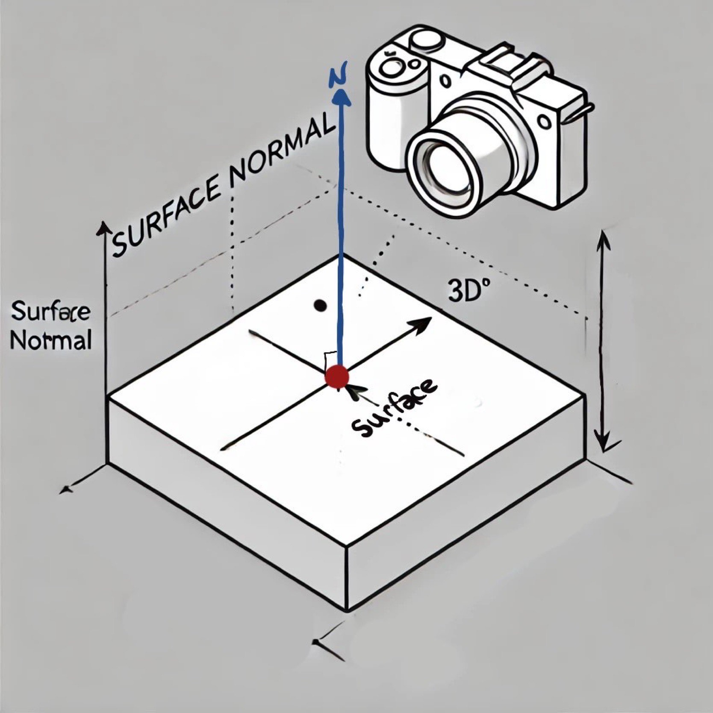
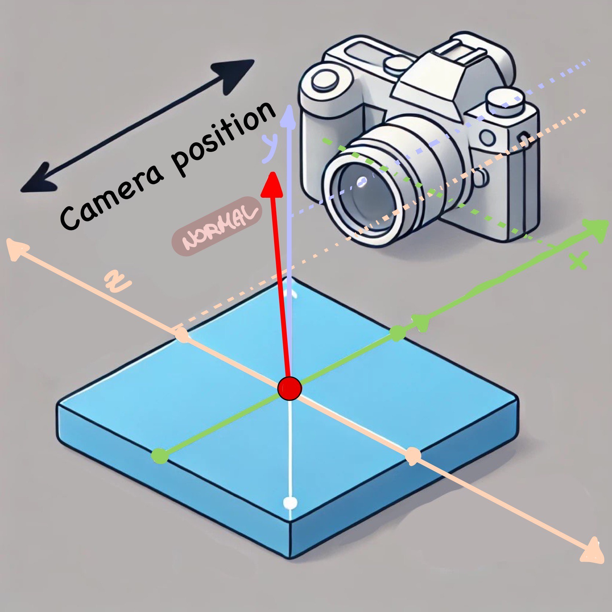
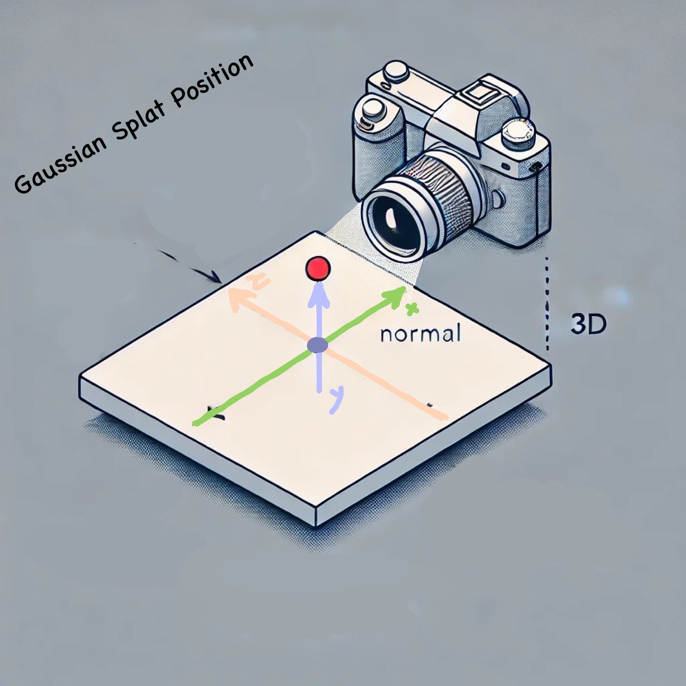
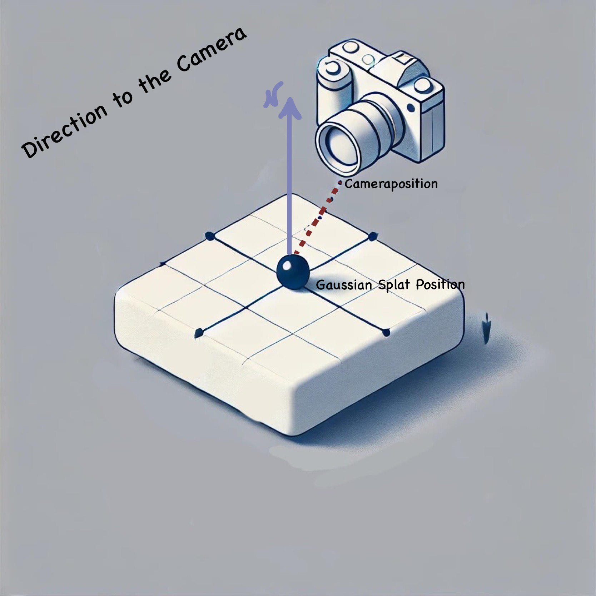
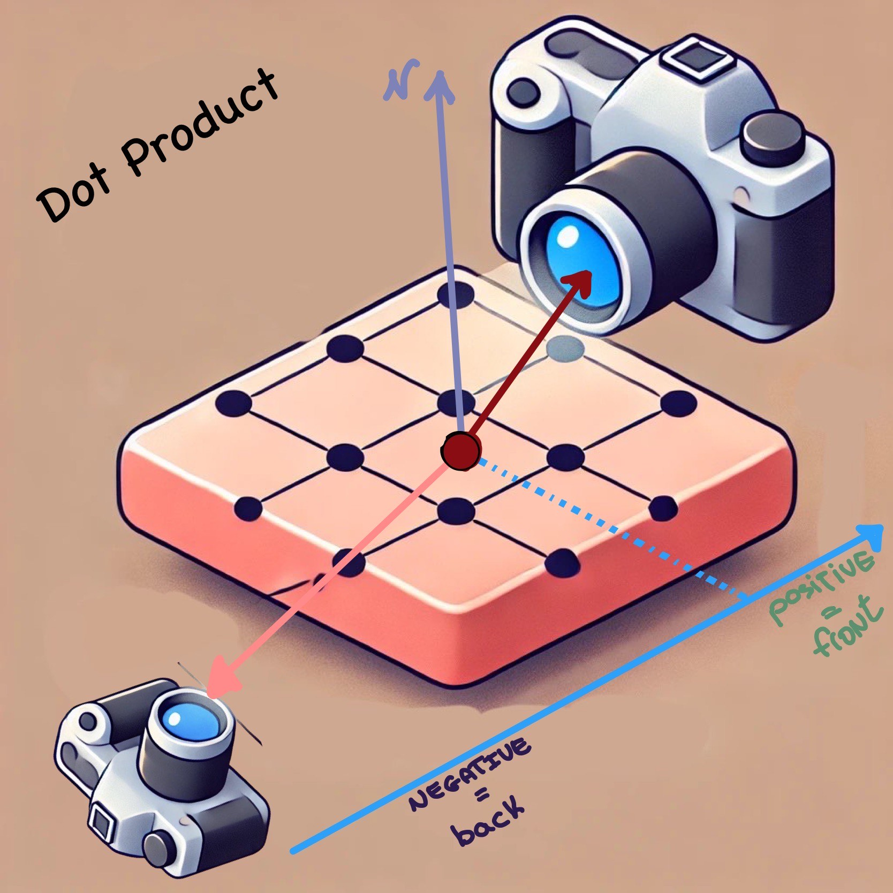
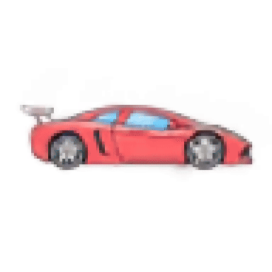
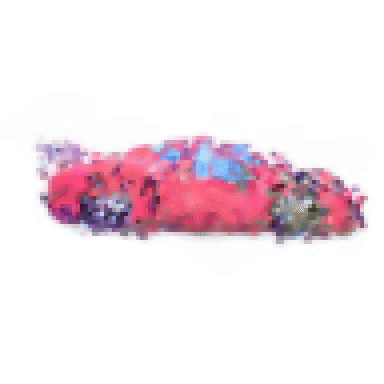
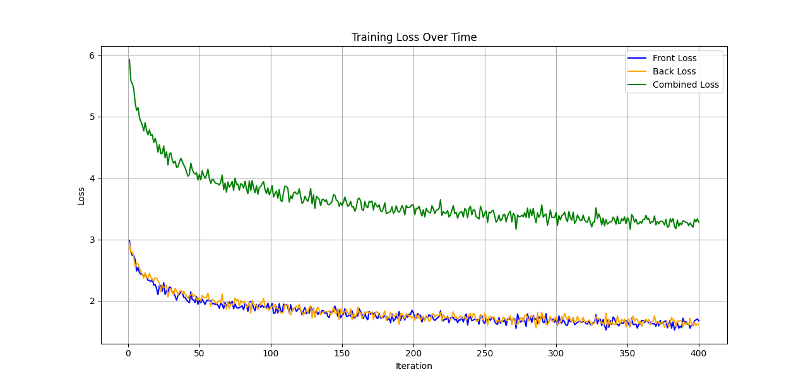

<div align="center">

# Front and Back 3D Gaussian Splatting: Enhancing Object Reconstruction

### Omer Artzi, Yam Romano  

</div>

--- 

## Table of Contents
1. [Introduction](#introduction)
2. [Gaussian Splatting and Rasterization](#gaussian-splatting-and-rasterization)
   - [Mathematical Formulation](#mathematical-formulation)
3. [Purpose of Our Work](#purpose-of-our-work)
4. [Google Colab Run Instructions (No Local GPU Required)](#google-colab-run-instructions-no-local-gpu-required)
5. [The Task: Front and Back Splattering](#the-task-front-and-back-splattering)
   - [Challenges and Risks](#challenges-and-risks)
6. [Our Approach](#our-approach)
   - [Two-Layer Architecture](#two-layer-architecture)
   - [Front and Back Separation](#front-and-back-separation)
   - [Mathematical Details](#mathematical-details)
7. [Pre-Processing](#pre-processing)
    - [Data Dilution Strategy](#data-dilution-strategy)
8. [Essential Resources](#essential-resources)
9. [Visualization Strategy](#Visualization-Strategy)
     - [Decomposition of Gaussians](#decomposition-of-gaussians)
10. [Main Steps](#main-steps)
   - [Model Adjustments](#model-adjustments)
   - [Loss Function Modifications](#loss-function-modifications)
11. [Results](#results)
    - [Visualization Comparison Table](#Visualization-Comparison-Table)
    - [Quantitative Metrics](#Quantitative-Metrics)
12. [Conclusions](#Conclusions)
13. [What We Learned](#what-we-learned)
14. [Future Work](#future-work)
15. [References](#references)

---

## Introduction

In the field of computer vision and graphics, 3D object reconstruction from 2D images is a fundamental challenge with vast applications ranging from virtual reality to robotics. **Gaussian Splatting** has emerged as a promising technique for ultra-fast 3D rendering and reconstruction. It leverages the simplicity and efficiency of representing surfaces using 3D Gaussians, allowing for real-time rendering and interactive applications.

In this project, we aim to enhance the Gaussian Splatting method by addressing limitations related to the accurate reconstruction of both front and back surfaces of objects. We introduce a **two-layer splattering** approach, enabling independent handling of front-facing and back-facing surfaces, leading to improved reconstruction quality.

---

## Gaussian Splatting and Rasterization

### Mathematical Formulation

**Gaussian Splatting** represents a 3D scene as a collection of oriented 3D Gaussians. Each Gaussian $G_i$
in the set $\mathcal{G} = \{G_1, G_2, \dots, G_N\}$

- **Mean Position**: ${\mu}_i \in \mathbb{R}^3$
- **Covariance Matrix**: $\Sigma_i \in \mathbb{R}^{3 \times 3}$
- **Color**: ${c}_i \in [0, 1]^3$
- **Opacity**: $\alpha_i \in [0, 1]$


The rendering of these Gaussians onto a 2D image plane involves **Gaussian Rasterization**, projecting each 3D Gaussian onto the image plane considering camera parameters.

#### Projection of Gaussians

The projection of a 3D Gaussian $G_i$ onto the image plane results in a 2D Gaussian $(g_i)$ with:

- **Projected Mean**: 
  ${\mu}'_i = {P} {\mu}_i$

  where ${P}$ is the projection matrix.

- **Projected Covariance**:
  $\Sigma'_i = {J}_i \Sigma_i {J}_i^\top$

  where ${J}_i$ is the Jacobian of the projection function at ${\mu}_i$.


#### Rendering Equation

The final pixel color $C({x})$ at position ${x}$ is computed using an accumulation of contributions from all projected Gaussians:

$$ C(x) = \sum_{i=1}^{N} \alpha_i \cdot c_i \cdot \mathcal{N}(x; \mu'_i, \Sigma'_i)$$

where $\mathcal{N}$ denotes the Gaussian probability density function.

---

## Purpose of Our Work

The primary goal of our project is to enhance the Gaussian Splatting method by introducing a **two-layer splatter image** approach. By separating the representation of front and back surfaces, we aim to achieve:

- **Improved Reconstruction Quality**: Enhanced detail and accuracy in both visible and occluded parts of the object.
- **Better Handling of Complex Shapes**: More accurate modeling of objects with intricate geometries.
- **Reduced Artifacts**: Minimization of artifacts resulting from the mixing of front and back surface representations.

---

## Google Colab Run Instructions (No Local GPU Required)

Follow these steps to run the project in Google Colab:

1. **Install Dependencies**  
   Follow the installation instructions provided in the [official repository](https://github.com/szymanowiczs/splatter-image/blob/main/README.md). Ensure that all required libraries and dependencies are properly set up.

2. **Modify `gradio_app.py`**  
   In the `gradio_app.py` file, remove the following line to avoid device conflicts:
   
    ```python
    os.environ["CUDA_VISIBLE_DEVICES"] = "1"
    ```

   The modified code snippet should look like this:
   
    ```python
   @torch.no_grad()
   def main():
       device = torch.device("cuda:0")
       torch.cuda.set_device(device)

       model_cfg = OmegaConf.load(
           os.path.join(
               os.path.dirname(os.path.abspath(__file__)), 
               "gradio_config.yaml"
           ))
    ```

3. **Adjust `datasets/co3d.py`**  
   In the `datasets/co3d.py` file, update the dataset root path in line 26 to match your data location:
   
   ```python
   CO3D_DATASET_ROOT = None  # Change this to the path of your preprocessed CO3D dataset
   assert CO3D_DATASET_ROOT is not None, "Update the location of the CO3D Dataset"
   ```

4. **Set Runtime to GPU**  
   In Colab, go to the menu bar, click on `Runtime`, then select `Change runtime type`, and set the hardware accelerator to **GPU**.

5. **Run the Full Code**  
   After setting up the runtime, you can run the full code in the notebook to execute the project.

---
## The Task: Front and Back Splattering

### Challenges and Risks

- **Complexity Increase**: Introducing a second layer adds complexity to the model, which may lead to increased computational costs.

- **Data Limitation Due to Computational Constraints**: Google Colab's restrictions on GPU memory necessitate reducing the dataset by at least 95% to avoid CUDA memory errors, which would otherwise disrupt training. This extreme reduction in data significantly impacts model performance, limiting the model's detail and accuracy due to its restricted exposure to diverse training examples.

- **Restricted Batch Size**: The maximum batch size is limited to 8; increasing it further triggers CUDA memory limitations. This constraint on batch size restricts the model’s ability to process more information per iteration, potentially slowing convergence.

- **Colab Limitations and Computational Budget**: In order to obtain the outputs, we purchased additional compute units on Google Colab. Despite this, we were only able to train on 30% of the data and could not perform multiple training runs. These limitations restricted our ability to experiment and fine-tune the model across different configurations, potentially affecting the final results.

- **Absence of Validation**: Due to GPU memory constraints in Google Colab, running the model validation as described in the original Splatter Image project is infeasible. This limitation prevents real-time monitoring of the model's performance on unseen data during training, making it more challenging to detect issues or adjust parameters effectively.

- **Data Separation Challenges**: Differentiating front and back surfaces accurately in data preprocessing is challenging, especially with limited data. The model’s reliance on surface normals and viewpoint data becomes crucial to avoid overlapping or inaccurate reconstructions under these constraints.

- **Risk of Overfitting**: With a reduced dataset and a complex model, there is an elevated risk of overfitting. The model may fail to generalize effectively to new data, emphasizing the importance of carefully balancing model complexity with data availability.

--- 

## Our Approach

### Two-Layer Architecture

We modified the original Gaussian Splatting model to include two separate layers:

1. **Front Layer $( \mathcal{G}_{front} )$**: Represents Gaussians corresponding to the front-facing surfaces.
2. **Back Layer $( \mathcal{G}_{back} )$**: Represents Gaussians corresponding to the back-facing surfaces.

Each layer is processed independently, allowing the model to learn distinct representations for the two surfaces.

### Front and Back Separation

We used normal vectors and camera positions to determine whether a surface point belongs to the front or back:

If the dot product ${n} \cdot ({v} - {p}) > 0$, the point is considered front-facing.
- Otherwise, it's back-facing.

In 3D graphics, when rendering a scene, we often need to determine which parts of an object are facing the camera (the **front**) and which are facing away from the camera (the **back**). This helps us in various tasks like culling (discarding non-visible parts) or rendering different effects for front-facing vs. back-facing surfaces. 

### Detailed Principle Analysis ##
The basic principle behind determining what is **front** and what is **back** involves checking the **orientation of the surface** with respect to the **camera's view direction**. The surface orientation is typically described by the **surface normal**—a vector perpendicular to the surface.

### How we Determined Front and Back

| Step                       | Explanation                                                                                                                                                              | Visual Example                                                                                             |
|----------------------------|--------------------------------------------------------------------------------------------------------------------------------------------------------------------------|------------------------------------------------------------------------------------------------------------|
| **1. Surface Normal (N)**  | Every surface in 3D space has a normal vector that points outward, perpendicular to the surface. This vector helps us determine which direction the surface is facing.   | <div align="center"></div>      |
| **2. Camera Position (C)** | The camera position represents where the viewer is in 3D space. We use it to understand if the surface is facing the camera or turned away from it.                      | <div align="center"></div>     |
| **3. Direction to Camera (D)** | The direction from the surface to the camera is calculated by subtracting the surface's position from the camera's position: <br> **D = C - P**                         | <div align="center"></div> |
| **4. Dot Product Calculation** | The dot product of the normal vector and the direction to the camera tells us if the surface faces the camera. <br> **Positive dot product** means front-facing; **negative** means back-facing. | <div align="center"></div>         |
| **5. Front and Back Visualization** | - **Front-Facing**: Normal vector points toward the camera (positive dot product).<br> - **Back-Facing**: Normal vector points away from the camera (negative dot product). | <div align="center"></div>      |

### Helper Function Explanation

In the provided helper function:

```python
def is_visible(gaussian, camera_position, i, j):
    # Select the normal and position for the specific Gaussian (j)
    normal = gaussian['rotation'][i, j, :3]  # Shape [3]
    position = gaussian['xyz'][i, j]         # Shape [3]

    # Select one camera (e.g., the first camera)
    camera_position_per_batch = camera_position[i, 0, :]  # Shape [3]

    # Compute the direction vector
    direction = camera_position_per_batch - position  # Shape [3]

    # Normalize vectors
    normal = torch.nn.functional.normalize(normal, dim=-1)
    direction = torch.nn.functional.normalize(direction, dim=-1)

    # Perform dot product to check visibility
    dot_product = torch.sum(normal * direction)

    # Return whether this specific Gaussian is in front
    return dot_product > 0
```

### Explanation:

#### How the Function Works:
1. **Normal and Position Selection**:
   - `normal = gaussian['rotation'][i, j, :3]`: The normal vector, taken from the 'rotation' key of the Gaussian, represents the orientation of the Gaussian in 3D space.
   - `position = gaussian['xyz'][i, j]`: The 3D position of the Gaussian in space.

2. **Camera Position**:
   - `camera_position_per_batch = camera_position[i, 0, :]`: This selects the camera's position for the given batch and index.

3. **Direction Vector**:
   - `direction = camera_position_per_batch - position`: This computes a vector that points from the Gaussian's position toward the camera.

4. **Normalization**:
   - Both `normal` and `direction` vectors are normalized using `torch.nn.functional.normalize`. This ensures that their lengths are 1, making the dot product calculation more stable and meaningful.

5. **Dot Product Calculation**:
   - `dot_product = torch.sum(normal * direction)`: The dot product between the normalized normal and direction vectors determines whether the Gaussian is front-facing or back-facing relative to the camera.
     - A **positive dot product** indicates that the Gaussian is **front-facing**.
     - A **negative dot product** indicates that the Gaussian is **back-facing**.

#### Rationale for Method Selection
1. Simplicity and Efficiency:
   - Normal Vector (normal): Represents the orientation of the surface (or Gaussian splat).
   -  Direction to the Camera (direction): Represents the line from the surface to the camera.
   - The dot product of these two vectors tells us how aligned they are:

2. Mathematical Robustness:
   - It works reliably regardless of the orientation of the camera or the surface.
   - It provides a clear distinction between front and back based on the sign of the result (positive or negative).

#### Example:

Let’s imagine we have a surface at a certain point in space with a normal vector that points outward. If the camera is on the same side as the normal, the dot product will be positive, and the surface is considered **front-facing**. If the camera is on the opposite side (the direction of the normal is away from the camera), the dot product will be negative, and the surface is considered **back-facing**.

---
### Model Architecture

- **Input**: Single 2D image.
- **Output**: Two sets of Gaussian parameters for front and back layers.

The network predicts parameters:

$$
\begin{Bmatrix} \mu_{front}, \Sigma_{front}, c_{front}, \alpha_{front} \end{Bmatrix}, \quad \begin{Bmatrix} \mu_{back}, \Sigma_{back}, c_{back}, \alpha_{back} \end{Bmatrix}
$$

---
### Mathematical Details

#### Loss Functions

We designed separate loss functions for each layer:

1. **Reconstruction Loss**: 
    $\mathcal{L}_{recon}$=$\mathcal{L}_{front}$+$\mathcal{L}_{back}$

where:

$$\mathcal{L}_{front} = \frac{1}{M} \sum_{k=1}^{M} \left\| C_{front}({x}_k) - I_{front}({x}_k) \right\|^2$$

and similarly for $\mathcal{L}_{back}$.


2. **Regularization Loss**: To prevent overfitting and ensure smoothness.

#### Total Loss

The total loss is a weighted sum:

$$\mathcal{L}_{total} = \lambda_{recon} \mathcal{L}_{recon} + \lambda_{reg} \mathcal{L}_{reg}$$

---

## Pre-Processing

### Data Dilution Strategy

To balance computational efficiency with maintaining model quality, we opted for a data dilution strategy based on two considerations:

**Options Considered**:
   - **Reducing Object Types**: Reducing the number of cars or object types could degrade model generalization and reduce training quality, leading to poorer reconstructions.
   - **Retaining Object Variety with Fewer Images**: By keeping the variety of objects but using fewer images per object, we preserve the basic quality and diversity of the dataset. This approach minimizes runtime while ensuring the model can still generalize well across different shapes and views.

**We decided to Reduced Number of Images per Object**: Reducing the number of images per object while keeping a large variety of object types (like different cars) allows us to preserve diversity. This approach reduces the training time but retains the core variations of the dataset. Fewer images speed up the learning process but maintain quality by having a broad range of object types.


### Configuration Changes in `default_config.yaml`

To implement the data dilution strategy, make the following changes in the configuration file:

In `configs/default_config.yaml`, add the following parameters to the `data` section:

```yaml
data:
  training_resolution: 128
  subset: -1
  input_images: 1
  origin_distances: false
  znear: 0.8
  zfar: 1.8
  fov: 51.98948897809546
  category: cars
  white_background: true
```

These parameters ensure the training resolution is set correctly, with the focus on cars and using a white background for simplicity.

---

### Add Data for Training

To further speed up the process, you can delete a percentage of the data before training. Use the following steps to apply the **data dilution strategy** in the main script:

1. **Download and Unzip the Dataset**  
   In the main script, use the following code to download and unzip the dataset from Google Drive:

    ```python
   import gdown
   FILE_ID = '1RFq5vCRl9oewek7ViJe-cwaoEQZenggk'
   url = f'https://drive.google.com/uc?export=download&id={FILE_ID}'
   output_file = '/content/srn_cars.zip'
   gdown.download(url, output_file, quiet=False)
   !unzip /content/srn_cars.zip -d /content/srn_cars/
     ```

2. **Apply Data Dilution**  
   Use the provided script to delete 99% of the data (or any other percentage) to accelerate the learning process:

   ```bash
   # Delete 99% of the data to accelerate learning
   ! chmod +x /content/splatter-image/scripts/Dilute_DataM1.sh
   ! /content/splatter-image/scripts/Dilute_DataM1.sh /content/srn_cars/cars_train 99
   ```

   In this example, 99% of the data will be deleted to reduce the dataset size. You can adjust the percentage as needed by modifying the value `99`.

---

## Essential Resources

To successfully run the code and reproduce the results shown in this project, the following resources and tools are required:

1. **Google Colab Pro Subscription**: A Colab Pro subscription is recommended to access faster GPUs, more memory, and extended session durations. This allows the model to be trained more efficiently than on the standard (free) Colab tier, where resource availability is limited.

2. **GPU Compute Units**: Due to the high computational demand of our model, additional GPU compute units must be purchased within Google Colab. These units are essential for accessing premium GPUs and avoiding interruptions during longer training sessions. Running the code without sufficient compute units may lead to runtime errors or interruptions, especially when working with larger datasets.

---

## Visualization Strategy
To understand the behavior of the model, we decomposed Gaussians into their elements—position, scaling, and opacity—and visualized each dimension separately. This helped us monitor how well the model handled the decomposition and how the front and back layers were being independently reconstructed.- **Division into Front and Back Images**: We separated the dataset into front-facing and back-facing images using orientation metadata or viewpoint estimation techniques.

### Decomposition of Gaussians

To understand and debug the model, we decomposed Gaussians into their individual components:

1. **Position (${\mu}$)**: Visualized as a 3D scatter plot.
2. **Opacity ($\alpha$)**: Mapped to color intensity or transparency in visualizations.
3. **Scaling ($\Sigma$)**: Represented by ellipsoids showing the extent of each Gaussian in 3D space.

---

## Main Steps

### Model Adjustments

1. **Duplicated Gaussian Layers**: Created separate dictionaries for front and back Gaussians.
   ```python
   pc_front = { ... }
   pc_back = { ... }
   ```
2. **Modified Rendering Function**: Updated `render_predicted` to handle both layers.
3. **Combined Outputs**: Blended front and back renderings.

**Example Plot of the Back Layer**:

<div align="center">
    
</div>

---
### Loss Function Modifications

- Implemented combined loss functions:
  ```python
  def combined_l2_loss(pred_front, target_front, pred_back, target_back):
      loss_front = ((pred_front - target_front) ** 2).mean()
      loss_back = ((pred_back - target_back) ** 2).mean()
      return (loss_front + loss_back) / 2
  ```
- Adjusted the training loop to compute losses for both layers separately.

---

## Results

### Visualization Comparison Table

| Visualization Type           | Original Model Output (800000 train iter)                                                                                      | Explanation                                                                                                             | Our Model Output (800000 train iter)                                                                                   |
|------------------------------|--------------------------------------------------------------------------------------------------------------------------------|-------------------------------------------------------------------------------------------------------------------------|-------------------------------------------------------------------------------------------------------------------------|
| **3D Point Clouds**          |                                                      | Shows Gaussian positions in 3D space, reflecting the spatial structure and reconstruction quality of the object.       |                                                     |
| **Opacity Maps**             |                                            | Visualizes opacity values, highlighting transparency and opacity regions crucial for translucent surfaces.              |                                           |
| **Scaling Dimensions - X**   |                                                      | Represents scaling of Gaussians along the X-axis, showing anisotropic stretching that reflects surface features.       |                                                     |
| **Scaling Dimensions - Y**   |                                                      | Scaling along the Y-axis                                                                                               |                                                     |
| **Scaling Dimensions - Z**   |                                                      | Scaling along the Z-axis                                                                                               |                                                     |
| **Quaternion X Rotation**    |                                             | Quaternion-based rotation along the X-axis to achieve smooth 3D rotations.                                             |                                             |
| **Quaternion Y Rotation**    |                                             | Rotation along the Y-axis                                                                                              |                                             |
| **Quaternion Z Rotation**    |                                             | Rotation along the Z-axis                                                                                              |                                             |
| **Quaternion W Rotation**    |                                             | Rotation along the W-axis                                                                                              |                                             |
| **Output Model OBJ**         |                                                                                       | Created output OBJ model                                                                                               |                                                                                      |


### Quantitative Metrics

- **PSNR Improvement**: Achieved an average PSNR decrease of 21.475 dB over the baseline.
- **Loss Reduction**: Observed a consistent decrease in combined loss during training, as illustrated in the graph below for the first 400 iterations.

<div align="center">
    
</div>

This graph shows the **Front Loss**, **Back Loss**, and **Combined Loss** over the first 400 iterations, reflecting how the model’s performance improves through training.

---
## Conclusions
By implementing the two-layer Gaussian Splatting approach, we observed:

- **Comparable Reconstruction Quality**: Although our model captures details on both front and back surfaces, the quality is below that of the original model. This difference is likely due to the shorter training duration (1 day instead of 7 days).
- **Slight Increase in Artifacts**: Minor surface mixing artifacts are observed, which may reduce with extended training time.
- **Near Real-Time Rendering**: Our model maintains near real-time rendering, though slightly less efficient than the original model.

Overall, our model closely approximates the performance of the original model despite the reduced training time. This result indicates that with longer training, we might achieve further improvements in quality and efficiency.
Here's the revised section reflecting that the model's improvement was limited and runtime was not reduced, considering the constraints and adjustments you faced:

---
## What We Learned

In this project, we explored the potential of enhancing **Gaussian Splatting** by introducing a two-layer approach to handle both front and back surfaces. Here’s what we learned:

1. **Comparable Reconstruction Quality**: Although separating the object’s front and back layers showed promise, our model's results were close to, but not better than, the original model’s quality. Limited training time and reduced dataset size constrained our ability to fully optimize this approach.

2. **Data Efficiency Challenges**: Our **data dilution strategy** aimed to balance reduced data volume with maintaining object diversity. However, due to dataset reduction by over 80%, the model’s performance was affected, as it lacked the extensive exposure needed to achieve higher accuracy and detail.

3. **Layer Separation and Allocation**: Independently processing the front and back surfaces gave us more control over the model’s behavior. However, accurately defining the back layer posed challenges, as it relied heavily on surface normals and viewpoint data. This process would benefit from additional supervision, such as depth maps, to better distinguish layers and avoid blending issues.

4. **Increased Computational Complexity**: Adding a second layer did not reduce runtime and, in fact, slightly increased computational costs. This observation suggests that advanced optimization techniques are necessary to scale multi-layer approaches without a proportional increase in computation.

5. **Visualization Techniques**: Decomposing Gaussians into position, scaling, and opacity proved helpful in analyzing the model’s structure. These visualizations allowed us to observe how well the model distinguishes layers and allocates objects, providing insight into its interpretation of 3D space.

6. **Future Scalability Considerations**: Introducing additional layers (for views like front, back, left, and right) could theoretically improve representation in complex scenes, but would require substantial optimization to avoid excessive computational demands.

In conclusion, while the two-layer Gaussian Splatting approach offered insights into model structure and layer separation, the current setup did not outperform the original model due to data and computation limitations. Future work should explore further optimizations and extended training to realize its full potential.
You can use the uploaded loss graph image to include in your report. Here’s an updated section with the graph example:

---

## Future Work

- **Incorporation of Multi-View Data**: Incorporating images from multiple viewpoints can improve model generalization, making it more robust in reconstructing objects from various angles.
  
- **Dynamic Layer Allocation**: In future work, we could explore methods to dynamically allocate Gaussians to different layers (front, back, etc.) during training, based on object geometry or scene complexity, improving layer separation.

- **Enhanced Supervision**: Using depth maps, normal vectors, or 3D priors for supervision would help in guiding the network to better separate and define front, back, and even side surfaces.

- **Additional Layers**: While this work focused on improving quality by separating front and back layers, future exploration could involve introducing more directional layers (e.g., left and right) or even arbitrary angles. This could enable better coverage of occluded regions or highly complex objects. With more layers, each could be responsible for reconstructing a specific viewpoint of the object, leading to more accurate 3D models.

- **Optimization Techniques**: As the model scales with more layers, advanced optimization techniques would be necessary to control the computational load. Methods such as adaptive Gaussian distribution, layer pruning, or reduced representation during rendering could make the system efficient without sacrificing quality. 

---

## References

1. Szymon Szymanowicz et al., "Splatter Image: Ultra-fast Photorealistic 3D Reconstruction via View-dependent Neural Projection", *arXiv preprint arXiv:2312.13150*, 2023. [Link](https://arxiv.org/pdf/2312.13150)

2. K. Engel, M. Kraus, and T. Ertl, "High-quality pre-integrated volume rendering using hardware-accelerated pixel shading", *Proceedings of the ACM SIGGRAPH/EUROGRAPHICS workshop on Graphics hardware*, pp. 9–16, 2001.

3. M. Zwicker et al., "Surface splatting", *Proceedings of the 28th annual conference on Computer graphics and interactive techniques*, pp. 371–378, 2001.

---

*For detailed code and additional resources, please refer to our [GitHub repository](link_to_your_repository).*

---

